# Manejo de excepciones en Python

Repositorio de práctica sobre **excepciones en Python** para la evidencia **GA1-220501096-01-AA1-EV05**. Incluye ejemplos progresivos, un reto final con entrada por consola y capturas de pantalla en la carpeta `imagenes/`.

## Requisitos

- Python 3.8 o superior
- Terminal (Git Bash, PowerShell o CMD)

```bash
python --version
```

## Estructura del proyecto

```
excepciones/
├── README.md
├── imagenes/                    # Capturas para la evidencia
├── ejemplos/
│   ├── 01_try_except.py
│   ├── 02_finally_else.py
│   ├── 03_excepciones_especificas.py
│   ├── 04_raise.py
│   ├── 05_validacion_datos.py
│   └── 06_excepciones_personalizadas.py
└── reto/
    └── dividir_numeros.py
```

## Contenido por archivo

| Archivo | Tema principal |
|---------|----------------|
| `01_try_except.py` | `try`/`except`, `ZeroDivisionError`, `ValueError`, `Exception` genérica |
| `02_finally_else.py` | Cuándo se ejecutan `else` y `finally` |
| `03_excepciones_especificas.py` | Varios `except` y captura múltiple |
| `04_raise.py` | `raise`, validación, re-lanzar excepciones |
| `05_validacion_datos.py` | Validar nombre, email y nota |
| `06_excepciones_personalizadas.py` | Excepciones propias y `CuentaBancaria` |
| `reto/dividir_numeros.py` | División segura con `try`, `except`, `else`, `finally` |

---

## Documentación visual (capturas)

Las imágenes están en [`imagenes/`](imagenes/). Cada bloque muestra el **código** o la **salida en consola** y una breve explicación.

### Nota: Git Bash y las rutas

En **Git Bash** no uses `\` en las rutas; usa `/`. Si escribes `ejemplos\02_...`, Bash interpreta `ejemplos02_...` y Python no encuentra el archivo.

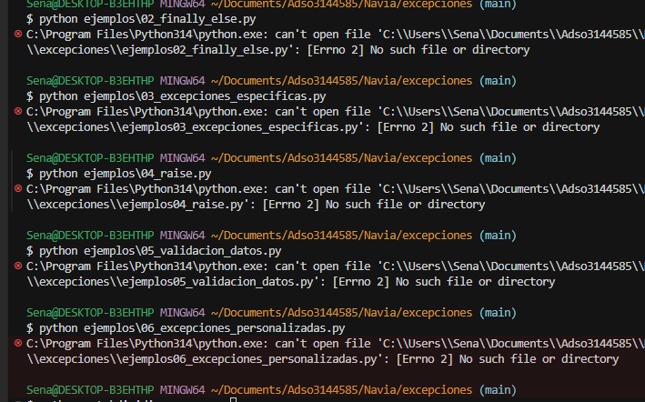

**Comando correcto:** `python ejemplos/02_finally_else.py`

---

### Ejemplo 2 — `else` y `finally`

El bloque `else` solo corre si **no** hubo excepción. El bloque `finally` corre **siempre**, haya error o no.

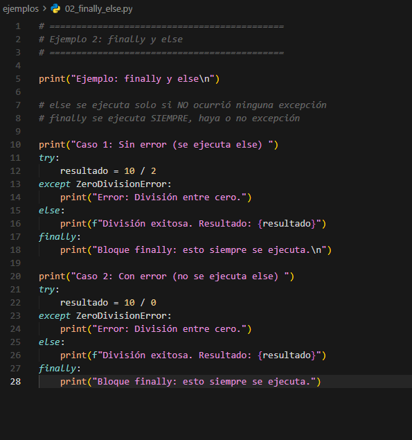

**Ejecutar:** `python ejemplos/02_finally_else.py`

- **Caso 1** (`10 / 2`): se imprime el resultado y el mensaje de `finally`.
- **Caso 2** (`10 / 0`): se captura `ZeroDivisionError`, no se ejecuta `else`, pero sí `finally`.

---

### Ejemplo 3 — Excepciones específicas

La función `procesar_dato` puede fallar por tres motivos distintos; cada uno tiene su propio `except`.

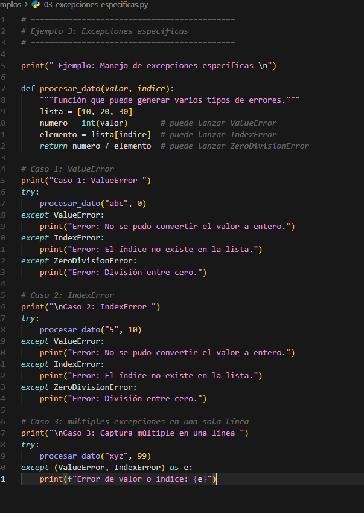

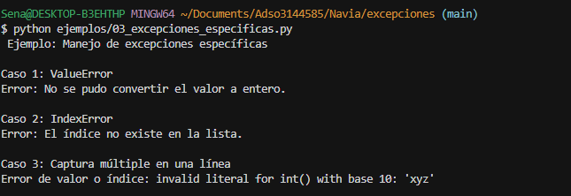

**Qué demuestra la consola:**

| Caso | Error | Mensaje |
|------|-------|---------|
| 1 | `ValueError` | No se pudo convertir `"abc"` a entero |
| 2 | `IndexError` | El índice 10 no existe en la lista |
| 3 | Captura múltiple | Un solo `except` para `ValueError` e `IndexError` |

---

### Ejemplo 4 — `raise`

Se validan datos con `raise` y se muestra cómo **re-lanzar** una excepción capturada.

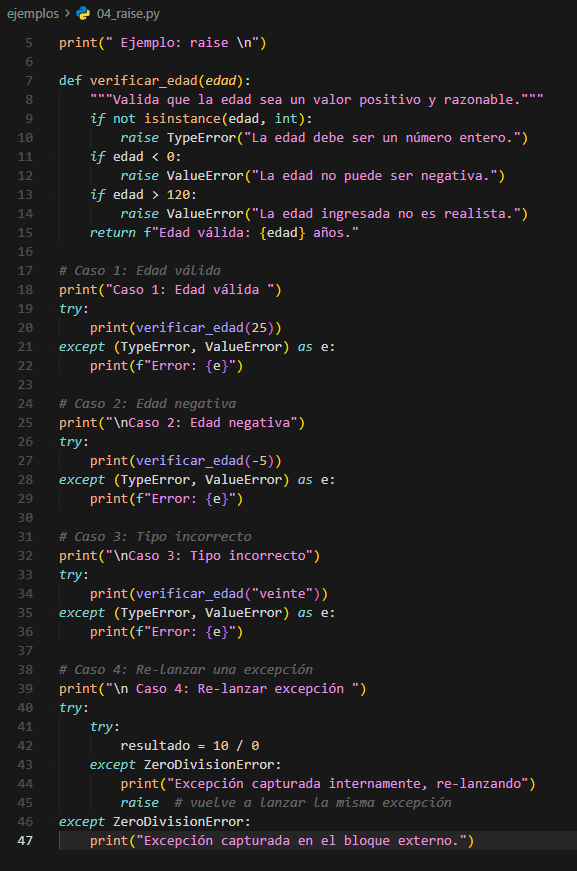

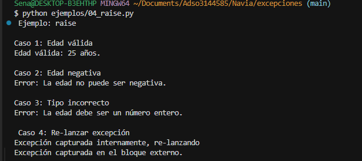

**Qué demuestra la consola:**

- Edad válida (25) → mensaje de éxito.
- Edad negativa (-5) → `ValueError` personalizado.
- Tipo incorrecto (`"veinte"`) → `TypeError`.
- Re-lanzar → se captura dentro, se vuelve a lanzar y se captura fuera.

---

### Ejemplo 5 — Validación de datos

Validación de nombre, correo y nota antes de registrar un estudiante.

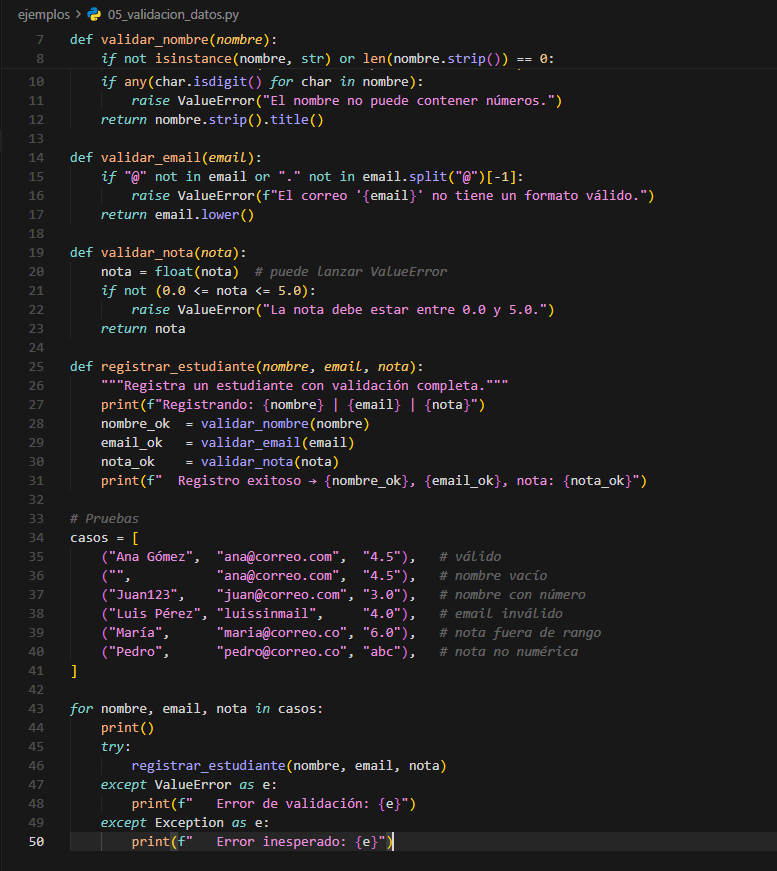

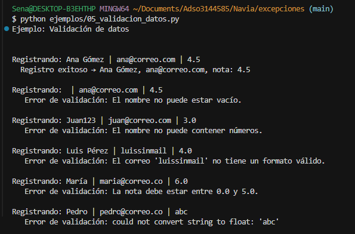

**Qué demuestra la consola:**

- Registro exitoso de Ana Gómez.
- Errores por nombre vacío, nombre con números, email inválido, nota fuera de rango (6.0) y nota no numérica (`abc`).

---

### Ejemplo 6 — Excepciones personalizadas

Clases de error propias (`SaldoInsuficienteError`, `MontoInvalidoError`, `CuentaBloqueadaError`) usadas en una cuenta bancaria simulada.

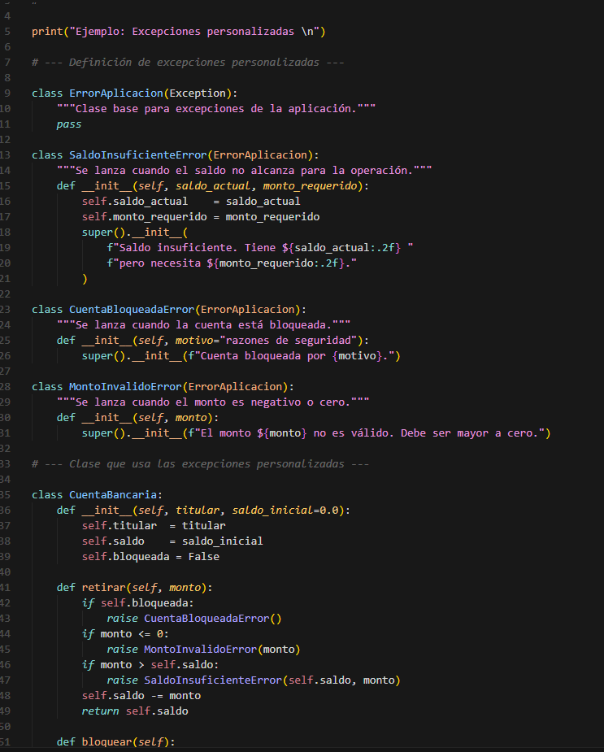

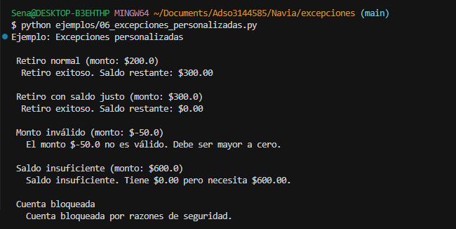

**Qué demuestra la consola:**

- Retiros exitosos y saldo restante.
- Monto negativo → `MontoInvalidoError`.
- Monto mayor al saldo → `SaldoInsuficienteError`.
- Cuenta bloqueada → `CuentaBloqueadaError`.

---

### Reto — Calculadora de división (`reto/dividir_numeros.py`)

Programa interactivo que pide dividendo y divisor, maneja `ValueError` y `ZeroDivisionError`, y siempre muestra *Operación finalizada* en `finally`.

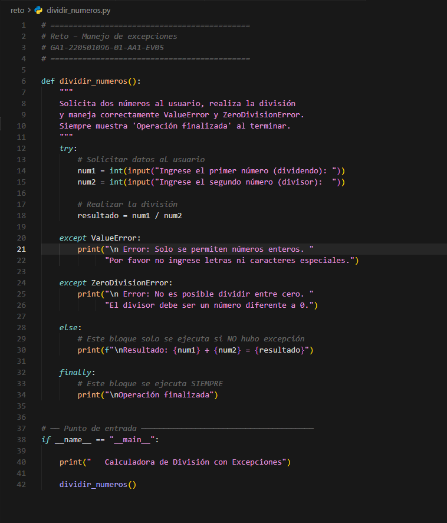

#### División correcta

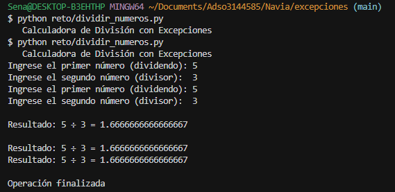

Entrada: `5` y `3`. Se ejecuta el bloque `else` (resultado) y luego `finally`.

#### Casos que debes capturar tú (misma ventana de terminal)

Ejecuta el reto **tres veces** y guarda captura de cada caso en `imagenes/` (por ejemplo `reto_division_cero.png` y `reto_valor_invalido.png`):

```powershell
cd "C:\Users\Sena\Documents\Adso3144585\Navia\excepciones"
python reto/dividir_numeros.py
```

| Prueba | Dividendo | Divisor | Qué debe aparecer |
|--------|-----------|---------|------------------|
| Éxito | `10` | `2` | Resultado + *Operación finalizada* |
| Cero | `8` | `0` | Error de división entre cero + *Operación finalizada* |
| Texto | `abc` | `5` | Error de solo enteros + *Operación finalizada* |

**Git Bash (entrada automática para probar rápido):**

```bash
cd ~/Documents/Adso3144585/Navia/excepciones
printf "8\n0\n" | python reto/dividir_numeros.py
printf "abc\n5\n" | python reto/dividir_numeros.py
```

> Si al ejecutar `python reto/dividir_numeros.py` ves mensajes de *cuenta bancaria* o *saldo*, es salida del ejemplo 06 en la misma terminal. Cierra la terminal, ábrela de nuevo y ejecuta solo el reto.

---

## Comandos para ejecutar todo

> **Git Bash:** usa `/` → `python ejemplos/01_try_except.py`  
> **PowerShell/CMD:** puedes usar `\` → `python ejemplos\01_try_except.py`

### Git Bash

```bash
cd ~/Documents/Adso3144585/Navia/excepciones

python ejemplos/01_try_except.py
python ejemplos/02_finally_else.py
python ejemplos/03_excepciones_especificas.py
python ejemplos/04_raise.py
python ejemplos/05_validacion_datos.py
python ejemplos/06_excepciones_personalizadas.py
python reto/dividir_numeros.py
```

**Una sola línea:**

```bash
cd ~/Documents/Adso3144585/Navia/excepciones && python ejemplos/01_try_except.py && python ejemplos/02_finally_else.py && python ejemplos/03_excepciones_especificas.py && python ejemplos/04_raise.py && python ejemplos/05_validacion_datos.py && python ejemplos/06_excepciones_personalizadas.py && python reto/dividir_numeros.py
```

### PowerShell

```powershell
cd "C:\Users\Sena\Documents\Adso3144585\Navia\excepciones"

python ejemplos\01_try_except.py
python ejemplos\02_finally_else.py
python ejemplos\03_excepciones_especificas.py
python ejemplos\04_raise.py
python ejemplos\05_validacion_datos.py
python ejemplos\06_excepciones_personalizadas.py
python reto\dividir_numeros.py
```

**Una sola línea:**

```powershell
cd "C:\Users\Sena\Documents\Adso3144585\Navia\excepciones"; python ejemplos\01_try_except.py; python ejemplos\02_finally_else.py; python ejemplos\03_excepciones_especificas.py; python ejemplos\04_raise.py; python ejemplos\05_validacion_datos.py; python ejemplos\06_excepciones_personalizadas.py; python reto\dividir_numeros.py
```

---

## Índice de imágenes

| Archivo | Descripción |
|---------|-------------|
| `gitbash_rutas_barra_invertida.png` | Error típico con `\` en Git Bash |
| `02_finally_else_codigo.png` | Código `else` / `finally` |
| `03_excepciones_especificas_codigo.png` | Código excepciones específicas |
| `03_excepciones_especificas_consola.png` | Salida ejemplo 03 |
| `04_raise_codigo.png` | Código `raise` |
| `04_raise_consola.png` | Salida ejemplo 04 |
| `05_validacion_datos_codigo.png` | Código validación |
| `05_validacion_datos_consola.png` | Salida ejemplo 05 |
| `06_excepciones_personalizadas_codigo.png` | Código excepciones propias |
| `06_excepciones_personalizadas_consola.png` | Salida ejemplo 06 |
| `reto_dividir_numeros_codigo.png` | Código del reto |
| `reto_division_exitosa.png` | Reto: división correcta |

---

## Autor

Proyecto de formación SENA — Análisis y desarrollo de software.

**Evidencia:** GA1-220501096-01-AA1-EV05
